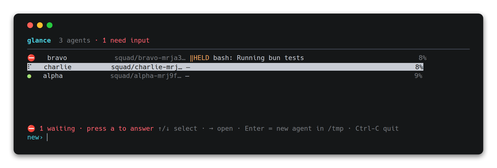
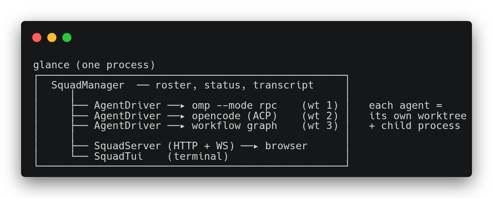
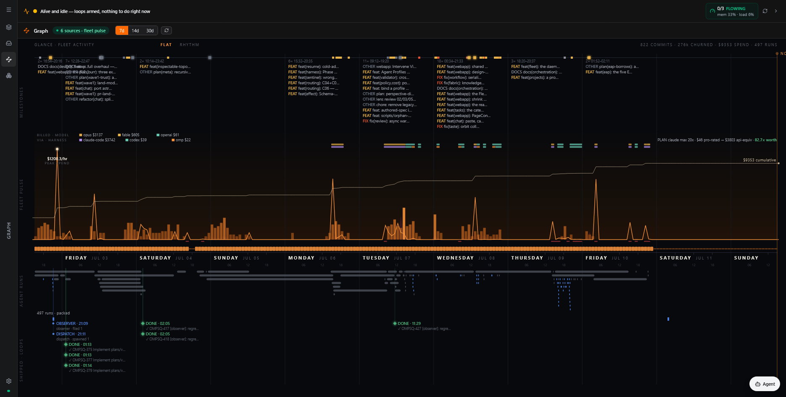

# glance


**Oversight for a fleet of coding agents running in parallel — one per git worktree, any
harness — from a terminal TUI and a web dashboard. You glance, and you know.**

The end goal is a single **control plane you run wherever development happens**: work goes in
as an issue or a chat message, a routed agent builds it in an isolated worktree, deterministic
gates prove it, and it lands on main — with you supervising by exception instead of babysitting
terminals. The loop is closed today: the daemon dispatches, verifies, commits, and merges
units of work end-to-end. Agents run on [Oh My Pi](https://omp.sh) by default, but the fleet is
**harness-agnostic** — any registered agent CLI (opencode, pi, claude-code, codex, gemini, …)
runs behind the same seam and shows up in the same roster. Cross-operator federation puts your
teammates' agents there too.


*The actual TUI: bravo is held on a `bash` approval, charlie is working, alpha is idle — and the
footer tells you one agent is waiting on you.*

> Formerly **omp-squad**. Both binaries are installed (`glance` and `omp-squad`), the canonical
> env prefix is `GLANCE_*`, and every legacy `OMP_SQUAD_*` variable keeps working unchanged.

## Why

You're running several coding agents at once (a refactor here, a bug hunt there, a spike in a
third repo). Without a control plane you lose track of which is busy, which finished, and
**which is blocked waiting for you**. glance is that control plane:

- **Isolation by default** — each agent works in its own `git worktree`, so parallel agents
  never clobber each other's files.
- **One glance** — a live status board: `working / idle / needs-input / error`, current
  activity, todo progress, context-window usage.
- **Never miss a blocked agent** — approval prompts, questions, and host-tool calls surface as
  **needs-input** with inline answer controls, and push a notification to your phone.
- **Steer from anywhere** — prompt, answer, interrupt, restart, or kill any agent from the TUI
  or the browser; a prompt to a busy agent steers its live session rather than restarting it.
- **Work lands itself** — the daemon commits a finished unit's work, proves it against
  deterministic gates, and merges (or stages a one-tap Land) with no one typing; a human is
  summoned only when the system can't prove its own work.
- **Any harness, one roster** — the fleet doesn't care which agent CLI does the work; every
  runtime sits behind one driver seam and gets the same status, steering, gates, and landing.

## How it works



Every fleet class — an omp operator, an ACP runtime, a sandboxed agent, a workflow run, a
commissioned worker — implements one `AgentDriver` seam, so the roster, TUI, web, gates, and
federation treat them identically; `kind` is the only difference. A **harness registry**
(`src/harness-registry.ts`) maps a harness name to its wire protocol (omp's newline-JSON RPC or
[ACP](https://agentclientprotocol.com)) and launch shape: `omp` (the default), `pi`, and
`opencode` are live-verified; `claude-code`, `codex`, `gemini`, and `auggie` are registered but
hidden until verified (`GLANCE_UNVERIFIED_HARNESS=1` to opt in). `glance harnesses` prints the
honest capability tier of every registered harness — verified, detected-but-unverified, or
merely registered — and the create surfaces only offer what's actually runnable.

Status is derived from each agent's event stream; the TUI consumes the manager in-process and
the web dashboard is a WebSocket client of the same stream. Roster state persists under
`~/.glance` (override with `GLANCE_STATE_DIR`; a legacy `~/.omp/squad` dir keeps working
untouched). Agents survive daemon restarts: each runs under a detached host process the daemon
reconnects to.

## Install

Requires [Bun](https://bun.sh) ≥ 1.3.14 and `omp` on your `PATH` (or any other verified
harness, with `GLANCE_HARNESS` pointing at it).

```bash
bun install
bun link            # optional: makes `glance` (and `omp-squad`) global
```

Run without linking via `bun src/index.ts <cmd>`.

## Quickstart

```bash
# Start the daemon — opens the TUI and serves the web dashboard (default :7878)
glance up

# …or headless (web only), e.g. on a server
glance up --no-tui
```

From another shell (talks to the running daemon):

```bash
# Spawn an agent in a fresh worktree of a repo, with an initial task
glance add ~/code/myproject --name auth-refactor \
  --task "Refactor the auth module to use the new session API."

glance list                                  # the roster
glance harnesses                             # which agent CLIs can run, and how trusted
glance prompt auth-refactor-<id> "Also update the tests."
glance logs auth-refactor-<id>               # recent transcript
glance kill auth-refactor-<id>               # emergency stop (keeps the entry)
glance rm auth-refactor-<id> --delete-worktree
glance open                                  # print the dashboard URL
```

`add` accepts `--harness`, `--profile`, `--model`, `--approval`, `--thinking`, `--branch`,
`--workflow`, `--verify`, `--sandbox`, and `--plain` — see the
[CLI reference](docs-site/content/docs/reference/cli.mdx). With a plain `--task`, an **intake
router** picks the process for you (verify loop, plan gate, fan-out, or plain agent); `--plain`
opts out.

> One daemon per state dir: `up` takes a single-writer lock and a second `up` against the same
> dir refuses to start. Leaving it running on a server? See
> [`docs/operations.md`](docs/operations.md).

## The dashboards

- **TUI** — a two-level, arrow-driven board (list → agent session) with a live stat header
  (branch · model · context % · cost · tokens), transcript scrollback, and slash commands
  (`/stop`, `/restart`, `/kill`). Type a task on the dashboard to spawn an agent.
- **Web** — an organizational command center: a durable **project registry** with a real
  switcher (projects are owned, not inferred from whatever happens to be running), a
  needs-input **Queue** you answer in place, per-agent transcript/diff/subagent views, and a
  **chat lane** that turns a conversation into work — propose → confirm → a routed agent
  spawns, with image paste and annotation. When an agent stops, the **Intervene** view leads
  with *why* it stopped and puts the diff at the spine — comment on a line and the comment
  becomes a steering prompt. Around that: a **Features** board with land-readiness and
  deterministic proof, plan **vote rounds** (assignees, quorum, commit-on-pass), a task canvas,
  workflow race boards, automation and audit trails, fleet health, and a settings surface for
  the daemon's feature flags. It installs as a PWA and **pushes a notification when an agent
  needs you** — supervise from your phone.


*The Graph — a week of fleet activity on one timeline: commit milestones, spend billed by
model × harness, the fleet pulse, agent runs, and the loops that shipped them.*

The full-featured web UI is the React app in [`webapp/`](webapp/), served when it's built and
`GLANCE_WEBAPP=1` is set; [`src/web/index.html`](src/web/index.html) is the zero-build fallback
dashboard. See the [web dashboard guide](docs-site/content/docs/guides/web-dashboard.mdx).

## The daily driver

Beyond dispatching a fleet, glance is built to be the thing you reach for instead of a bare
`claude` terminal — this is a live dogfooding experiment, gated on real use, not a finished
claim.

```bash
cd ~/code/myproject
glance here                          # a chat thread on this directory, in this terminal
```

`glance here` attaches a casual chat to your current directory on your own claude-code
login — no `glance add`, no task string, no harness to pick. Edits land in your **real**
checkout via one-directional **boundary sync** (each turn's patch applies iff your tree
hasn't moved since the turn started; otherwise it's held with Apply/Discard, never silently
dropped or overwritten), a daemon restart re-attaches you honestly instead of hanging, a
finished long-running turn can buzz your phone, and `/grr` logs friction without breaking
your flow. A weekly drain turns that friction plus adoption counters (visible in the web
dashboard's Graph view) into an honest two-week gate: sustained daily use decides what ships
next, and the verdict is never automated. Full operator guide, including the honest residuals
and known limits: [`docs/daily-driver.md`](docs/daily-driver.md).

## Autonomy — the factory loop

With a [Plane](https://plane.so) workspace configured, the daemon closes the whole loop —
issue → routed agent → verify → land → close — with bounded background loops, **all on by
default** (each opts out with `GLANCE_<NAME>=0`; `GET /api/factory/status` shows which are
armed, fueled, and moving). Crucially, the daemon **commits the unit's work itself** before
proving it — a unit never fails to land because its agent forgot to commit.

| Loop | What it does |
|---|---|
| **Auto-dispatch** | Polls open Plane issues, spawns one routed agent per issue — priority-ordered, WIP-capped, restart-safe ledger |
| **Orchestrator** | Verifies and lands idle agents, self-heals red gates within a repair budget, parks repeat failers, summons a human on `CATASTROPHE:` |
| **Observer** | Audits fleet vs. intended state (red gate on main, unreaped survivors, blocked lands) and files fix-issues |
| **Scout** | Harvests latent work from agent *reasoning* — bugs noticed in passing, deferred follow-ups — into triage-gated issues |
| **Opportunity** | Clusters recurring Scout items across agents into one pattern issue |
| **Auto-supervisor** | Answers routine low-risk approvals so agents don't idle — but only for harnesses whose permission wire it actually understands; destructive requests always wait for a human |
| **Plan sync** | Reconciles `plans/` doc STATUS lines with tracker state |
| **Janitors** | Reap landed agents, orphan hosts, and dead worktrees — losslessly, bounded |

Safety posture: every land passes a deterministic verify gate (optionally inside a network-less
container sandbox, optionally a full-suite regression gate); by default a green verify **stages
a one-tap Land** rather than blind-merging (`GLANCE_LAND_CONFIRM=0` for full auto-merge);
destructive approvals are never auto-answered; provider rate-limit signals pause dispatch; and
failure caps live in branch-keyed ledgers that survive restarts — including a bounded escalation
cap on repeatedly land-blocked units, so nothing retries forever in silence. Details:
[Autonomy](docs-site/content/docs/architecture/autonomy.mdx) ·
[Landing](docs-site/content/docs/guides/landing.mdx) ·
[Plane integration](docs-site/content/docs/integrations/plane.mdx).

### Honesty as architecture

The failure mode of an autonomous fleet isn't a crash — it's a system that *looks* green while
doing nothing. glance treats that as an architectural class:

- **Fail-closed checkers** — a gate that cannot run reports failure, never success; probe
  failures are classified, not swallowed.
- **Harness honesty tiers** — every registered harness carries a live-verified / detected /
  merely-registered tier, surfaced in `glance harnesses` and the API, so "supported" always
  means something checkable.
- **Success-coupled accounting** — cost attribution is a task-class × model matrix where
  tokens and dollars are only comparable alongside outcomes, behind a reproducibility gate
  (sample size, coverage, variance) before any number is published.

## Landing — getting work back to main

`landAgent` commits an agent's branch and merges it back — serialized per-repo, gated on the
repo's own verify command, rolled back on red, refused when the branch is stale against evolved
main. A **land-mode probe** picks the route per repo: merge directly into the main checkout, or
open a PR with clean automerge-and-retry when the repo's remote calls for it. Conflicts are
resolved by a rebase-based auto-resolver whose result must **prove** itself (verify gate +
independent reviewer pass) or the land is abandoned; a resolved conflict is always staged for a
human one-tap Land by default. See [Landing](docs-site/content/docs/guides/landing.mdx) for the
full gate stack and its env knobs.

## Beyond a single agent

- **Agent profiles** — a per-unit capability bundle: profile → harness, binary, model,
  thinking level, approval mode, MCP bindings, memory. Defined by the operator
  (`GLANCE_PROFILES`) or committed to the repo (`.glance/profiles.json`, sanitized — a repo can
  pick a verified harness but can never smuggle in a binary or inline MCP server).
- **Workflows** — author an agent's *process* as a reviewable graph (fabro's Graphviz/DOT
  dialect): plan gates, verify loops, parallel fan-out where each branch is a real steerable
  roster agent, and per-node model routing via a CSS-like `model_stylesheet`. Bundled:
  `plan-implement`, `research-plan-implement`, `fan-out`, `resolve-conflict`, `commission`.
  Runs are durable — two-phase checkpoints resume across a full daemon crash.
  → [Workflows](docs-site/content/docs/workflows/index.mdx)
- **Commissioning** — the fleet authors its own specialized workers: an architect agent writes
  a small scoped [Flue](https://flueframework.com) worker, an acceptance gate validates it in a
  secret-scrubbed env, and only a passing worker joins the roster.
  → [Commissioning](docs-site/content/docs/commissioning/index.mdx)
- **Sandboxed agents** — `--sandbox <image>` runs an agent's harness inside a container
  (worktree bind-mounted, network optional), composable with any registered harness.
  → [Sandboxing](docs-site/content/docs/guides/sandboxing.mdx)
- **Federation** — presence, file leases, and shared-branch collision warnings across
  operators; on by default locally, cross-host via a WebSocket coordinator on your tailnet,
  including addressed remote commands (`POST /api/federation/command`).
  → [Federation](docs-site/content/docs/integrations/federation.mdx)
- **Capabilities** — checksum-pinned packs of profiles/workflows/recipes, imported from trusted
  manifests or the built-in public catalog; machine-readable discovery at `/llms.txt` and
  `/openapi.json`. → [Capabilities](docs-site/content/docs/integrations/capabilities.mdx)
- **Feedback intake** — an opt-in public widget for user bug reports with validation voting,
  Plane promotion, and optional reward payouts via Tremendous.
  → [Intake](docs-site/content/docs/integrations/intake.mdx) ·
  [Payments](docs-site/content/docs/integrations/payments.mdx)

## Remote access & multi-tenant

The dashboard is token-gated (bearer token generated on first boot, printed with one-tap
sign-in links) and installs as a PWA over HTTPS — front it with `tailscale serve` for a real
cert in one command. Setting `DATABASE_URL` switches the daemon to **DB mode**: BetterAuth
accounts and orgs (email + password, GitHub social login, WorkOS SSO + SCIM provisioning)
replace the bearer token. File mode remains the default — and the autonomous factory's native
habitat. → [Remote access](docs-site/content/docs/guides/remote-access.mdx)

## Configuration

Everything is env-driven and defaulted; see [`.env.example`](.env.example) and the
[configuration reference](docs-site/content/docs/reference/configuration.mdx). The canonical
prefix is `GLANCE_*`; the legacy `OMP_SQUAD_*` spelling of every prefixed variable is honored
indefinitely (`GLANCE_*` wins when both are set). Plane (`PLANE_*`), database/auth
(`DATABASE_URL`, `BETTER_AUTH_*`, `GITHUB_*`, `WORKOS_*`), and a few tool-specific vars are
unprefixed.

## Documentation

Full docs live in a self-contained [Fumadocs](https://fumadocs.dev) site under
[`docs-site/`](docs-site/) — MDX pages, ⌘K search, an Ask-AI chat, and machine-readable
`llms.txt` / `llms-full.txt` endpoints. It's a separate Next.js app with its own
`node_modules`, so the core package stays dependency-light.

```bash
cd docs-site
bun install        # first run only
bun run dev        # http://localhost:3000/docs
```

Content is authored in `docs-site/content/docs/*`. Set `OPENROUTER_API_KEY` in
`docs-site/.env.local` to enable the Ask-AI chat.

## Verify

```bash
bun test            # deterministic suite — no model tokens spent
bun run check       # typecheck
```

A full model-driven smoke test (spawn → work → artifact) is in the
[quickstart](docs-site/content/docs/getting-started/quickstart.mdx).

## Layout

| Path | Role |
|---|---|
| `src/index.ts` | CLI + daemon entry (`glance` / `omp-squad`) |
| `src/squad-manager.ts` | Roster, status derivation, transcript, `applyCommand` |
| `src/server.ts` | HTTP + WebSocket bridge (REST API + dashboards) |
| `src/tui.ts` | Terminal dashboard |
| `webapp/` | React 19 + Vite + Tailwind web dashboard (`GLANCE_WEBAPP=1`) |
| `src/web/index.html` | Zero-build fallback dashboard |
| `src/harness-registry.ts` · `src/agent-profiles.ts` | Harness registry + honesty tiers, per-unit profiles |
| `src/rpc-agent.ts` · `src/agent-host*.ts` | omp RPC child + detached restart-surviving host |
| `src/acp-agent-driver.ts` · `src/sandbox-agent-driver.ts` · `src/flue-service-driver.ts` · `src/workflow-driver.ts` | The other `AgentDriver` implementations |
| `src/workflow/` | Graph engine — DOT parser, walker, executors, model stylesheets |
| `src/intake.ts` · `src/dispatch.ts` · `src/orchestrator.ts` · `src/scheduler.ts` · `src/supervisor.ts` | Autonomy: routing, dispatch, control loop, admission, auto-answer |
| `src/land.ts` · `src/land-mode.ts` · `src/land-pr.ts` · `src/proof.ts` · `src/land-ledger.ts` · `src/orchestrator-state.ts` | Landing (direct or PR), deterministic proof, restart-safe ledgers |
| `src/project-registry.ts` | Durable project registry behind `/api/projects` |
| `src/plan-votes.ts` · `src/plan-vote-quorum.ts` | Plan vote rounds — assignees, quorum, commit-on-pass |
| `src/federation*.ts` · `src/coordinator*.ts` · `src/presence.ts` · `src/leases.ts` | Federation, presence, file leases |
| `src/architect.ts` · `src/worker-template.ts` · `src/validate.ts` | Commissioning |
| `src/capabilities/` | Capability packs — schema, import, install, catalog |
| `src/plane.ts` · `src/plane-throttle.ts` | Plane client + shared rate limiter |
| `workflows/` | Bundled workflow graphs (`.fabro`) |
| `docs-site/` | The documentation site |
| `tests/` | Deterministic test suite |
