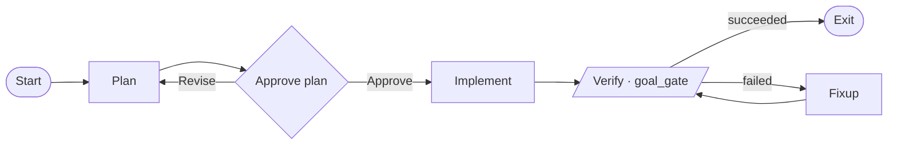

> Status: prototype (Phase A). Adds a third fleet class — **workflow** agents —
> that run a *process authored as a graph* instead of a free-text task. The
> dialect is the Graphviz/DOT subset [fabro](https://github.com/fabro-sh/fabro)
> uses, so workflows are diffable, version-controlled artifacts.

## The bet

An omp operator's *process* is implicit — whatever the model decides given a task
and an approval mode. The one place omp-squad already had an explicit process is
the [commission loop](/docs/commission-loop) (`JOB → AUTH → GATE{fail→AUTH} → ONB`),
hand-coded in `commission()`. A workflow runtime generalizes that single pipeline
into **authorable graphs**: plan → human-approval gate → implement → verification
gate → bounded fix-up loop. You review the *plan* before the diff, and intervene
only at the gates.



## Why a workflow is just another agent

omp-squad's whole architecture is "anything implementing `AgentDriver` joins the
roster, status derivation, transcript, and federation" — proven by `RpcAgent` and
`FlueServiceDriver`. A workflow run is exactly that contract:

| `AgentDriver` | workflow meaning |
|---|---|
| `start()` | parse the graph, prepare the engine |
| `prompt(goal)` | first prompt starts the run; later prompts steer the live agent |
| `abort()` | cancel the run + the inner turn |
| `getState()` | synthetic — stages become `todoPhases` (the dashboard's done/total) |
| `respondUi()` | answer a human gate (or the inner agent's own approval) |
| `event` frames | one `agent_start … agent_end` around the run; stages + command output between |

So `kind: "workflow"` lands a graph-driven, gated, multi-model-ready run in the
same TUI / web / federation / Plane-spawn surfaces as an omp operator. Manager
footprint: a `kind`, one `makeDriver` branch, one poll-filter widen — identical to
how `flue-service` dropped in.

## The decision that matters: pure engine, injected execution

The naive port is "`WorkflowDriver` runs the whole graph internally." It ships
fast but **traps the graph engine inside a leaf driver** — and omp-squad's headline
is *parallel agents as first-class roster members*. A fan-out done that way would
hide its branches inside one row's subagent panel.

Instead the engine is **pure orchestration** and execution is an injected seam:

```
src/workflow/
  types.ts     — Workflow / WorkflowNode / WorkflowEdge + the NodeExecutor seam
  dot.ts       — parse the DOT subset → typed graph (quoted multi-line scripts,
                 comments, edge chains, conditions)
  engine.ts    — WorkflowEngine.run(goal): routing, edge conditions, goal_gate,
                 retry_target, visit caps, human-gate pausing, stage emission
  executor.ts  — SingleAgentExecutor: the Phase-A NodeExecutor (agent thread + shell)
  commission-executor.ts — CommissionExecutor: drives the commission graph's action nodes
  verify-workflow.ts     — buildVerifyWorkflow: synthesizes the --verify implement → verify → fixup loop
src/workflow-driver.ts — WorkflowDriver implements AgentDriver
```

- `WorkflowEngine` knows nothing about omp, processes, or the fleet. It is unit-
  tested with a fake executor (no tokens).
- `SingleAgentExecutor` binds **every agent node to one persistent omp thread**, so
  a run is one steerable roster entry — correct for plan→implement→verify. Command
  nodes shell out in the worktree; human gates raise a callback.
- **Action nodes (Phase B):** a node with an `action="<name>"` attribute is run by the
  executor's optional `runAction` — a host-registered domain step, not an agent turn or
  shell command. The [commission loop](/docs/commission-loop) is now a graph
  (`workflows/commission/workflow.fabro`) whose `author`/`validate`/`onboard` action nodes
  are bound by `CommissionExecutor`, with a bounded re-author loop on a failed gate. This
  is the proof the injected-execution seam generalizes the engine past agent/shell nodes.
- **Verify loop (Phase C):** `omp-squad add --verify "<cmd>"` wraps an ordinary task in a
  synthesized `implement → verify → fixup` graph (`buildVerifyWorkflow`, built directly so
  the command needs no DOT escaping) — reusing this engine instead of hand-rolling a second
  fix-up loop. "Agent says done" becomes "done AND the gate is green."
- **Parallel fan-out (Level 2):** a `component` fork spawns one **real roster agent per
  branch** via the engine's `runBranch` seam — the manager's `WorkflowFleet` calls
  `create()` so each branch is an independent, steerable worktree agent — runs them
  concurrently (`max_parallel`), and a `tripleoctagon` merge joins them (`join_policy`).
  Branches are single agent nodes for now; multi-node branches stay deferred.
- **Conflict resolution (bundled graph):** `workflows/resolve-conflict/workflow.fabro` is a
  plain Phase-A graph (no new engine features) — `merge → resolve (agent) → verify → fixup
  → commit` — that lands a branch whose merge into main conflicts. `git rerere` replay is
  wired into the merge node, the agent is told to combine both sides, and the verify
  `goal_gate` authorizes the commit so a textually-clean-but-broken merge can't land. It's
  the integration layer expressed in the same vocabulary as everything else.

## Node types (Phase A)

| Shape | Kind | Behaviour |
|---|---|---|
| `Mdiamond` / `Msquare` | start / exit | entry / terminal |
| `box` (default) | agent | an agentic omp turn with tools |
| `tab` | prompt | a reasoning turn (Phase A runs it like an agent turn) |
| `parallelogram` | command | a shell script; outcome from exit code |
| `hexagon` | human | pause; outgoing edge labels are the choices |
| `diamond` | conditional | pure routing, no execution |
| `component` / `tripleoctagon` | parallel / merge | fan out to fleet agents, then join (Level 2) |
| `insulator` | wait | parsed, not executed yet (clear error) |

Routing: a `human` node takes the edge whose label matches the chosen option;
everything else takes the first edge whose `condition` holds, else the first
unconditioned edge; a failed `goal_gate` with no match falls back to `retry_target`.
`max_visits` (per node) / `max_node_visits` (graph) bound fix-up loops.

Conditions: `outcome=succeeded|failed`, `preferred_label=<label>`, `context.<k>=<v>`,
combined with `&&` / `||` and `!=`.

## Human gates reuse needs-input

A `human` node emits a synthetic `extension_ui_request{method:"select"}` with the
edge labels as options. The manager's existing `onUi` turns that into an `input`
status + a `PendingRequest`; the answer routes back through `respondUi`. No new gate
UI — and the inner agent's *own* approval prompts surface through the same channel.

## Usage

```bash
omp-squad add ~/code/myproject --name feature \
  --workflow workflows/plan-implement/workflow.fabro \
  --task "Add rate limiting to the public API."
```

The bundled `workflows/plan-implement/workflow.fabro` is a plan → approve →
implement → verify → fixup graph; edit its `verify` `script` for your stack.

## What's prototype vs. deferred

- **Real:** the DOT parser, the pure engine (routing, conditions, goal-gate fix-up
  loops, visit caps), human gates over the needs-input path, the `SingleAgentExecutor`
  (agent turns + shell commands), action nodes + `CommissionExecutor` (Phase B), the
  `--verify` synthesized loop (Phase C), per-node model/effort routing via a CSS-like
  `model_stylesheet` that switches the agent thread before each turn (Phase D), parallel
  fan-out spawning one real roster agent per branch with `wait_all` / `first_success` joins
  (Level 2), a `SandboxAgentDriver` running an agent inside a container over `docker exec`
  (Phase E), the `WorkflowDriver` + manager wiring, persistence of the workflow `kind`, and
  the stage → todo rollup.
- **Deferred:** multi-node parallel branches (today a branch is a single agent node),
  `prompt`-node no-tool enforcement, `wait` nodes, and resuming an in-flight run across a
  daemon restart (the inner host survives via `detach()`, but the engine state does not).
