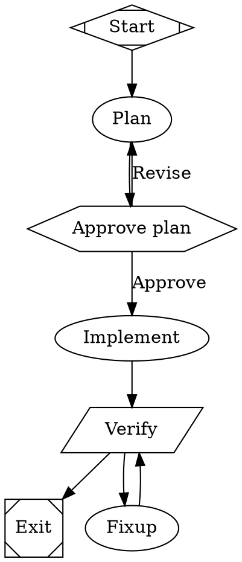

import { TypeTable } from 'fumadocs-ui/components/type-table';

A workflow is a `digraph` written in the DOT subset fabro uses, parsed by
`src/workflow/dot.ts` into a typed `Workflow`. The parser is deliberately narrow: it supports
node statements, edge statements (including chains `a -> b -> c`), graph-level attributes,
`key=value` graph assignments, quoted multi-line values (a `script` or `model_stylesheet`),
`\"` / `\\` escapes, `\`-newline line continuation inside strings, and `//`, `#`, `/* */`
comments. Subgraphs and DOT default node/edge attribute blocks are **not** supported and raise
a `WorkflowParseError`.

Every graph needs exactly one start node (`Mdiamond`) and exactly one exit node (`Msquare`);
the parser resolves them by shape and errors if either is missing or ambiguous.

## Node shapes

A node's `shape` attribute picks its behaviour (kind). Omit `shape` and the node is an
**agent** node (`box` is the default). The mapping in `dot.ts` is exact — an unknown shape is
a parse error.

<TypeTable
  type={{
    Mdiamond: { description: 'start — graph entry. Exactly one per graph.', type: 'start' },
    Msquare: { description: 'exit — terminal. Reaching it ends the run as succeeded. Exactly one.', type: 'exit' },
    box: { description: 'agent — an agentic omp turn with tools (the default when shape is omitted).', type: 'agent' },
    tab: { description: 'prompt — a single reasoning turn (Phase A runs it like an agent turn).', type: 'prompt' },
    parallelogram: { description: 'command — run a shell script; outcome is the exit code (0 = succeeded).', type: 'command' },
    hexagon: { description: 'human — pause; the outgoing edge labels are the choices.', type: 'human' },
    diamond: { description: 'conditional — pure routing, no execution.', type: 'conditional' },
    component: { description: 'parallel — fan out to one fleet agent per branch.', type: 'parallel' },
    tripleoctagon: { description: 'merge — fan in; join the parallel branches.', type: 'merge' },
    insulator: { description: 'wait — parsed but not executed yet (raises a clear error if reached).', type: 'wait' },
  }}
/>

## Node attributes

Attributes are `key=value` pairs in a `[ … ]` block. Quoted values may span lines and contain
`[`, `]`, `;`, `&&`, regexes, and newlines. Every raw attribute is also kept on `node.attrs`
for forward compatibility, so unrecognized keys (e.g. `class`, `timeout_ms`) are preserved and
read by the executor.

<TypeTable
  type={{
    label: { description: 'Display name (TUI/web stage label). Falls back to the node id.', type: 'string' },
    prompt: { description: 'agent / prompt: task instructions. A leading @path.md is read relative to the workflow file dir.', type: 'string' },
    script: { description: 'command: the shell script to run (bash -lc in the worktree).', type: 'string' },
    action: { description: 'Run a host-registered domain step via the executor\u2019s runAction instead of an agent turn or shell command (e.g. commission\u2019s author/validate/onboard).', type: 'string' },
    model: { description: 'Per-node model override; switches the agent thread before this node\u2019s turn. Wins over the model_stylesheet.', type: 'string' },
    reasoning_effort: { description: 'Per-node reasoning effort (minimal|low|medium|high|xhigh). Wins over the model_stylesheet.', type: 'string' },
    goal_gate: { description: 'true marks a node the run must eventually pass. A failed goal-gate with no matching edge routes to retry_target.', type: 'boolean', default: 'false' },
    retry_target: { description: 'On failure with no matching outgoing edge, route here (the fix-up loop target).', type: 'string' },
    max_visits: { description: 'Max executions of this node in one run; overrides the graph default. Exceeding it fails the run (this bounds fix-up loops).', type: 'number', default: 'max_node_visits (50)' },
    class: { description: 'Space-separated classes matched by .class selectors in the model_stylesheet.', type: 'string' },
    timeout_ms: { description: 'agent / prompt: per-turn timeout for this node.', type: 'number', default: '600000' },
  }}
/>

### Graph-level attributes

Set inside `graph [ … ]` (or as bare `key=value` assignments):

<TypeTable
  type={{
    goal: { description: 'The run\u2019s default goal, used when no --task overrides it.', type: 'string' },
    max_node_visits: { description: 'Default per-node visit cap when a node sets no max_visits.', type: 'number', default: '50' },
    model_stylesheet: { description: 'CSS-like per-node model routing, resolved by the executor. See Model routing.', type: 'string' },
  }}
/>

## Edges and routing

An edge carries two optional attributes:

- `label` — the display name and, on a [human node](/docs/workflows/gates), the choice text. The
  engine routes a human node to the edge whose `label` equals the chosen option.
- `condition` — a routing predicate evaluated against the run context.

Routing for every non-human node: the engine takes the **first edge whose `condition` is
true**; failing that, the **first unconditioned edge** (the fallback); failing *that*, a node
with `goal_gate=true` that just failed routes to its `retry_target`. So order the conditioned
edges before the fallback.

### Condition grammar

`evalCondition` (in `engine.ts`) parses an OR of ANDs of comparison atoms:

```text
condition := clause ( "||" clause )*
clause    := atom ( "&&" atom )*
atom      := lhs ( "=" | "==" | "!=" ) rhs
```

- `lhs` resolves `outcome`, `preferred_label`, `context.<name>`, or a bare context variable.
- `rhs` is a literal (surrounding quotes optional).
- Anything unparsable evaluates to **false**.

| Variable | Set by | Example |
|---|---|---|
| `outcome` | The last node's result (`succeeded` / `failed`). | `condition="outcome=succeeded"` |
| `preferred_label` | The label chosen at the most recent human gate. | `condition="preferred_label=Continue"` |
| `context.<k>` | Free-form run variables. | `condition="context.stack=rust"` |

Combine them:

```dot
verify -> exit   [condition="outcome=succeeded"]
review -> ship   [condition="outcome=succeeded && context.risk!=high"]
gate   -> retry  [condition="outcome=failed || preferred_label=Revise"]
```

<Callout type="info">
Both `=` and `==` mean equality; `!=` is inequality. `context.<k>` reads `ctx.vars[k]`; a bare
`lhs` with no prefix is also read from `ctx.vars`. There is no `<`/`>`/numeric comparison —
conditions are string equality only.
</Callout>

## A fully annotated workflow

This is the shipped `workflows/plan-implement/workflow.fabro`, annotated. It is the canonical
reviewable process: plan, human-approve the plan before any production code, implement, then a
verification gate that loops into a bounded fix-up cycle until green.



Edit the `verify` `script` for your stack (the default targets a Bun/TS repo). Run it:

```bash
omp-squad add ~/code/myproject --name feature \
  --workflow workflows/plan-implement/workflow.fabro \
  --task "Add rate limiting to the public API."
```
