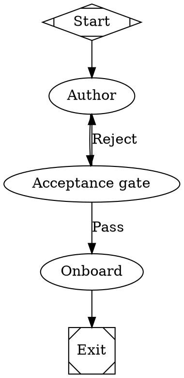
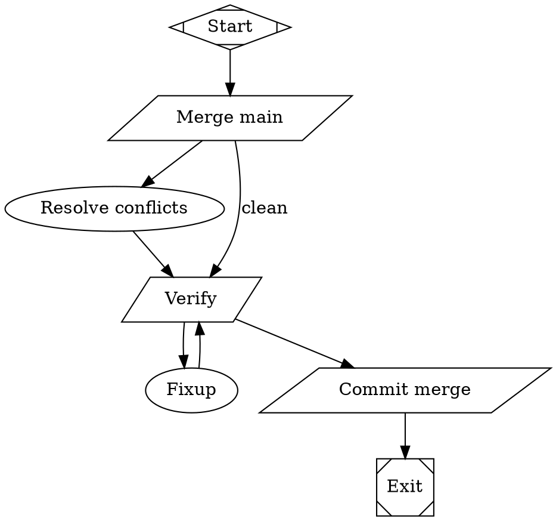

import { Step, Steps } from 'fumadocs-ui/components/steps';

glance ships five workflow graphs under `workflows/`. Point `--workflow` at one by name (or
at any `.fabro` path of your own) and `--task` becomes the run's goal.

```bash
glance add ~/code/myproject --workflow plan-implement \
  --task "Add rate limiting to the public API."
```

## How `--workflow <name|path>` resolves

`resolveWorkflowPath` (`src/squad-manager.ts`) tries, in order:

<Steps>
<Step>
**An existing path.** If the spec is a file that exists, use it as-is — this is how
`--workflow ./my-graph.fabro` and absolute paths work.
</Step>
<Step>
**A bundled directory.** Otherwise look for `<pkg>/workflows/<name>/workflow.fabro`. This is
what makes `--workflow plan-implement` (and every name below) first-class.
</Step>
<Step>
**A bundled file.** Otherwise look for `<pkg>/workflows/<name>` (appending `.fabro` if absent).
</Step>
<Step>
**Verbatim.** Falling through, the spec is passed through unchanged (and will fail to parse if
it is not a real graph).
</Step>
</Steps>

The CLI help advertises `research-plan-implement`, `plan-implement`, and `fan-out`, but the
resolver matches **any** directory under `workflows/`, so `commission` and `resolve-conflict`
resolve by name too.

<Callout type="info">
`--verify "<cmd>"` is the no-graph cousin: it skips DOT entirely and **synthesizes** an
`implement → verify → fixup` graph around your `--task` (`buildVerifyWorkflow`), with the gate
being exit 0 of `<cmd>`. Same engine, no `.fabro` to author. See
[verify loops](/docs/guides/verify-loops).
</Callout>

| Name | Graph | Reach for it when… |
|---|---|---|
| `plan-implement` | `plan → approve → implement → verify → fixup` | You want to review the plan before any code, with a verify gate. |
| `research-plan-implement` | `research → plan → approve → file-to-plane → implement → verify → fixup` | A large goal should be decomposed into Plane issues and implemented end-to-end. |
| `fan-out` | `fork → {branches} → merge → review` | You want several approaches tried in parallel and a winner picked. |
| `commission` | `author → gate → onboard` (action nodes) | You're hiring a scoped Flue worker (driven internally). |
| `resolve-conflict` | `merge → resolve → verify → fixup → commit` | A branch won't land because main moved under it. |

## plan-implement

The canonical reviewable process: plan, human-approve the plan **before** production code,
implement, then a verification `goal_gate` that loops into a bounded fix-up cycle. One human
checkpoint (the `approve` hexagon). The default `verify` script targets a Bun/TS repo
(`bun run check && bun test`) — edit it for your stack. Walked through in full on the
[authoring page](/docs/workflows/authoring).

## research-plan-implement

The full Plane pipeline as a graph:

```text
research → plan → approve(human) → file-to-plane → implement → verify → fixup
```

One persistent omp thread carries context across phases, so the research brief, the plan path,
and the filed issue IDs flow forward without re-deriving them. The single human checkpoint is
the plan-approval gate — review scope before issues are filed or code is written. The
`implement` phase loops the Plane module's issues one at a time (promote-issue then
claim-and-implement). It **commits but does not push**; you review and push. This is the
workflow the manager spawns for auto-features and auto-dispatch.

<Callout type="warn">
Prerequisites for the spawned agents: the `plane` MCP connected, and the research / plan /
plan-to-plane / promote-issue / claim-and-implement skills installed. The `verify` script
auto-detects the toolchain (Bun, pnpm, npm, Cargo). See [Plane integration](/docs/integrations/plane).
</Callout>

## fan-out

`fork → {simple, fast, lean} → merge → review` — explore one goal from three angles at once,
each branch a real roster agent in its own worktree, then a review node picks the winner. The
`component`/`tripleoctagon` mechanics are covered in [parallel fan-out](/docs/workflows/fan-out).

## commission

The hire-a-worker loop, expressed as a graph of **action nodes** (`author → gate → onboard`)
driven by `CommissionExecutor` rather than agent turns. A failed acceptance `gate`
(`goal_gate=true`, `retry_target="author"`) loops back to re-author, bounded by `author`'s
`max_visits=2`, feeding the failure forward as authoring guidance. It is the formerly
hand-coded `commission()` pipeline on the same pure engine — the proof the injected-execution
seam generalizes past agent/shell nodes.



See [commissioning](/docs/commissioning) for the architects, the acceptance gate, and the Flue
service.

## resolve-conflict

glance's integration-layer resolver. When a feature branch won't land because main moved
under it, this graph brings main **into** the branch, auto-resolves the conflicts, **proves**
the result with the repo's own verify gate, and commits — leaving the branch
fast-forwardable into main.



`git rerere` replays resolutions it has seen before; the agent handles the rest. A clean merge
skips `resolve` and goes straight to `verify`. Crucially, the **verify gate — not the absence
of conflict markers — authorizes the commit**, so a textually-clean but semantically broken
merge can't land. The land flow invokes it on a conflicting land, or run it directly against a
conflicted branch's worktree. See [landing](/docs/guides/landing).
