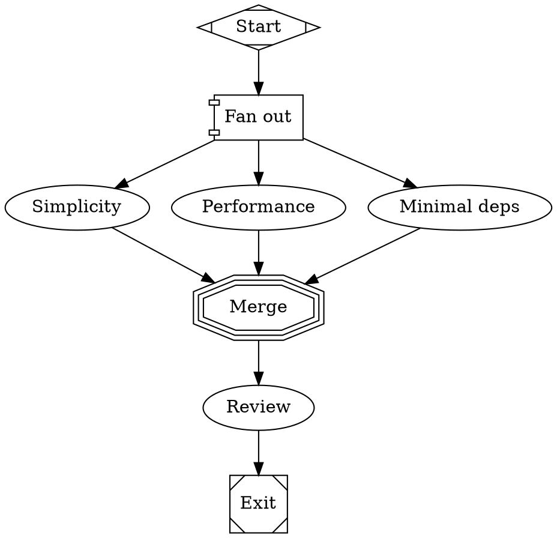

import { Step, Steps } from 'fumadocs-ui/components/steps';

Fan-out is where "the engine is pure, execution is injected" pays off. A `component` fork does
**not** hide its branches inside one row's subagent panel — each branch becomes an
independent, steerable fleet agent in its own worktree, a real roster member you can open,
steer, and land. A `tripleoctagon` merge joins them back into the single workflow thread.

```text
            ┌─▶ simple ─┐
start ─▶ fork ─▶ fast ──┼─▶ merge ─▶ review ─▶ exit
            └─▶ lean ───┘
   (component)      (tripleoctagon)
```

## How a fork runs

When the engine (`engine.ts`, `runParallel`) hits a `parallel` node it reads the fork's
outgoing edges — **each `from === fork.id` edge is one branch** (`fork -> simple`,
`fork -> fast`, `fork -> lean`) — and runs them concurrently.

<Steps>
<Step>
**Collect branches.** Every node the fork points at is a branch. Each branch is a *single
agent node* (multi-node branches are deferred).
</Step>
<Step>
**Fork the context.** Each branch gets an isolated `RunContext` (its `vars` are copied from the
parent), so branches never clobber each other's state — fabro semantics.
</Step>
<Step>
**Spawn real agents.** With a `fleet` wired (the manager always wires one), each branch calls
`runBranch` → `WorkflowFleet.runBranch` → the manager's `spawnFleetBranch`, which `create()`s a
real roster agent: `parentId` = the workflow agent, `autoRoute: false`, `bypassCap: true`, and
the branch node's `model`. The branch's prompt is `Goal: <goal>\n\n<branch prompt>`.
</Step>
<Step>
**Run with bounded concurrency.** At most `max_parallel` branches are in flight at once;
results preserve branch order. The branch agent stays in the roster after it finishes.
</Step>
<Step>
**Join at the merge.** Once branches settle, the engine routes to the graph's single `merge`
node, which passes the join outcome through to ordinary routing.
</Step>
</Steps>

<Callout type="info">
Without a fleet (`spawnBranch` absent), `runBranch` falls back to `runAgent` and the branches
run **sequentially on the shared inner thread**. The manager always supplies a fleet, so in
practice branches are real parallel roster agents; the fallback is what keeps the engine
unit-testable.
</Callout>

## Fork attributes

Set these on the `component` node:

| Attribute | Values | Default | Meaning |
|---|---|---|---|
| `join_policy` | `wait_all` · `first_success` | `wait_all` | How the merge's outcome is computed (below). |
| `max_parallel` | integer ≥ 1 | `4` | Max branches in flight at once (bounded concurrency). |

### Join policies

The join outcome flows out of the merge as the run's `outcome`:

- **`wait_all`** — succeeds only if there is at least one branch **and every branch
  succeeded**. Any failure fails the join.
- **`first_success`** — succeeds as soon as **one** branch succeeds, and **short-circuits**:
  the moment a branch wins, the remaining branches are signalled to stop and their roster agents
  are torn down, so the join never blocks on a slow or hung loser.

The engine also records `context.parallelResults` — a JSON array of
`{ branch, outcome }` — into the run context after the join. A branch that would exceed its
visit cap returns `failed` rather than running again. A branch whose executor **throws** fails
only that branch (it becomes `failed`); its still-running siblings are then signalled to stop so
a crashed branch never leaves orphaned agents or worktrees behind.

<Callout type="warn">
The merge resolution requires **exactly one** `tripleoctagon` node in the whole graph
(`findMerge`). Zero or two merge nodes throw at run time. Every branch should connect to that
one merge.
</Callout>

## Branches in the roster

Each branch is created with `parentId` set to the workflow agent, so it **nests under the
parent** in the TUI tree and web dashboard, rendered with its kind glyph alongside its
siblings. The branches run with `bypassCap: true`, so a fan-out is never blocked by the live
agent cap. They are full roster agents: each has its own worktree, transcript, and steering —
the fan-out's parallelism is first-class, not a hidden subagent.

## The bundled fan-out graph

`workflows/fan-out/workflow.fabro` explores one goal from three angles at once, then reviews:



```bash
glance add ~/code/myproject --workflow fan-out \
  --task "Add an LRU cache to the request path."
```

Three branch agents spawn (`simple`, `fast`, `lean`), each in its own worktree implementing the
goal under a different optimization brief; once all three finish, the `review` node compares the
worktrees and picks the winner.
