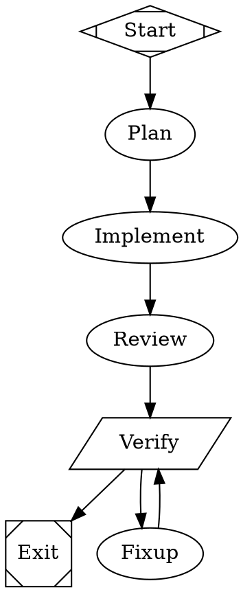

Different nodes deserve different brains. Planning and review want a frontier model at high
reasoning effort; a mechanical fix-up or a quick reasoning turn can run cheap. A workflow's
graph-level `model_stylesheet` declares that mapping in a CSS-like syntax, and the executor
switches the single agent thread's model + reasoning effort **before each node's turn** — one
line, no per-node attribute noise.

```dot
graph [ model_stylesheet="
  *        { model: haiku;  reasoning_effort: low; }
  .hard    { model: opus;   reasoning_effort: high; }
  #review  { model: gpt-5; }
" ]
```

That sheet means: everything runs `haiku`/`low` by default, any node tagged `class="hard"`
runs `opus`/`high`, and the node with id `review` runs `gpt-5` (keeping `low` effort from the
universal rule).

## Selectors

`parseStylesheet` (`src/workflow/stylesheet.ts`) flattens each `selector { decls }` block into
rules. A block declaring neither `model` nor `reasoning_effort` is dropped; a selector list
(`a, b { … }`) becomes one rule per selector.

| Selector | Matches | Specificity |
|---|---|---|
| `*` | every node (universal default) | 0 |
| `.class` | nodes whose `class` attribute (space-separated) contains `class` | 10 |
| `#id` or bare `id` | the node with that id | 100 |

Two declarations are recognized inside a block:

- `model:` — a **fuzzy** model spec resolved against omp's available models (exact id,
  provider-scoped substring like `anthropic/opus`, or a plain substring like `haiku`).
- `reasoning_effort:` — one of `minimal`, `low`, `medium`, `high`, `xhigh`.

## Resolution precedence

`resolveNodeStyle` collects every rule that matches a node, sorts them **low → high
specificity** (`*` < `.class` < `#id`), and applies them in order so the most specific wins;
ties break by source order (later rule wins). Finally a node's **own** `model=` /
`reasoning_effort=` attribute overrides the sheet entirely.

```text
universal (*)  <  class (.x)  <  id (#n)  <  node's own model= / reasoning_effort= attr
```

`model` and `reasoning_effort` resolve independently — a node can take its `model` from a
`#id` rule while its `reasoning_effort` falls back to the universal default.

## How the thread switches

The `SingleAgentExecutor` runs every agent/prompt node on one persistent omp thread. Before a
node's turn (`runAgent` in `executor.ts`) it resolves the node's style and, **only when the
value changed** from the last node, calls the inner driver's `setModel` / `setThinkingLevel`.
So the thread carries one model/effort until a node demands a different one — a `plan` node can
bump to a frontier model, `implement` and `fixup` can drop back to something cheaper, all
within the same steerable roster entry.

<Callout type="info">
Switching is best-effort: `setModel` / `setThinkingLevel` are optional on `AgentDriver` and
failures are swallowed (a model spec that matches nothing simply leaves the thread on its
current model). Set a node-level `model=` attribute to force a specific model regardless of the
sheet.
</Callout>

## A worked example

Plan and review on a strong model, the grind on a cheap one:



- `plan` is `class="thinking"` → `claude-opus-4-5` / `high`.
- `review` matches `#review` (effort `medium`) and `*` (model `claude-haiku-4-5`) → it keeps
  the cheap model but thinks a little harder.
- `implement` and `fixup` match only `*` → `claude-haiku-4-5` / `low`.

The thread is created once; the model and effort follow the graph node by node.
