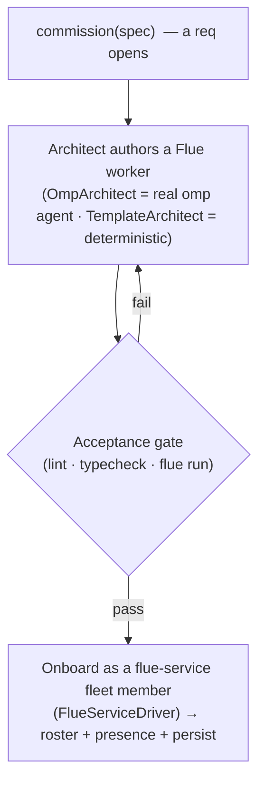

# Commissioning loop — agents that hire agents

> Status: prototype (Phase 1.5). The single-operator squad manages **omp operators**.
> This adds a second fleet class — **Flue service agents** — and a loop that lets the
> OS *author* one to fill a job, the way an org opens a req and onboards a hire.

## The bet

In a human org, a job opens → someone is hired → they're onboarded. Here we replace
the hire with **the OS authoring its own specialized worker**. The wager is on
*agents building agents*: a fuzzy job spec goes in, a capable builder agent writes a
small, scoped, deployable worker, and — only if it passes an acceptance gate — the
worker is onboarded into the live fleet.



## Two fleet classes, one roster

| | `omp-operator` (existing) | `flue-service` (new) |
|---|---|---|
| Runtime | `omp --mode rpc` child in a git worktree | a Flue worker invoked via `flue run` |
| Role | interactive, steerable dev sessions | autonomous / bounded org automation |
| Builder | spawned directly by an operator | **authored by an architect agent** |
| Substrate seam | `RpcAgent` | `FlueServiceDriver` |
| Status source | omp event stream | synthesized omp-style frames around a run |

Both implement one **`AgentDriver`** contract, so the `SquadManager` derives status,
buffers a transcript, federates presence, and routes `applyCommand` identically for
both. `kind` is the only thing a surface needs to tell them apart.

## The `AgentDriver` seam

The manager already programs against the exact surface `RpcAgent` exposes. We name it:

```ts
export interface AgentDriver extends EventEmitter {
  readonly isReady: boolean;
  readonly isAlive: boolean;
  start(timeoutMs?: number): Promise<void>;
  stop(): Promise<void>;
  prompt(message: string): Promise<void>;     // omp: a turn · flue: invoke the workflow
  abort(): Promise<unknown>;                   // omp: abort turn · flue: cancel run
  getState(): Promise<RpcSessionState>;        // flue: synthetic (no todos/context)
  setSessionName?(name: string): Promise<unknown>;
  respondUi(id: string, payload: { value?: string; confirmed?: boolean; cancelled?: true }): void;
  respondHostTool(id: string, text: string, isError?: boolean): void;
}
```

- `RpcAgent implements AgentDriver` — no behavioural change; it already had every member.
- `FlueServiceDriver implements AgentDriver` — adapts a deployed/local Flue worker.
  `prompt(msg)` runs the worker's workflow with payload `{ text: msg }` (or `msg`
  parsed as JSON) and **emits omp-shaped frames** — `agent_start` → `message_update`
  (the result JSON) → `message_end` → `agent_end` — so the manager's existing
  `onAgentEvent` derives `working → idle` with zero new status code. `respondUi` /
  `respondHostTool` are no-ops (a `flue run` invocation surfaces no interactive
  requests to us); `getState` returns a synthetic `RpcSessionState`.

The manager builds the right driver from a member's `kind` via one factory, so
`create` (operator), `restart`, and `commission` (service) all share the same wiring.

## The commission loop

`SquadManager.commission(spec, { architect, install, requireAcceptance }, actor)`:

1. **Resolve a worker dir** — `~/.omp/squad/workers/<name>/` by default.
2. **Author** — the `Architect` writes a Flue worker project into the dir:
   - `OmpArchitect` (default): drives a real `omp --mode rpc` agent (approval `yolo`,
     write) with a compact Flue recipe + the spec; the agent writes the files. This is
     the *agents-build-agents* path.
   - `TemplateArchitect` (deterministic): renders a known-good worker from the spec
     (`spec.workflowBody` spliced in). Used by the test suite and as an offline fallback.
3. **Acceptance gate** — `validateWorker(dir, spec)`, tiered and degrading:
   - **lint** (mandatory, pure): workflow exports `run`; agent module (if `model`) default-exports
     `createAgent`; model specifier is `false` or a valid `provider/model`; the
     `flue.worker.json` manifest declares a capability allowlist.
   - **typecheck** (if deps installed): `tsc --noEmit` over the worker.
   - **acceptance** (if `flue` resolves + `spec.accept`): `flue run <wf> --payload <accept.payload>`,
     then deep-subset match the result against `accept.expect`.
   - `ok` requires lint to pass and no tier to *fail*; a tier with no tooling is `skip`.
4. **Onboard** — on `ok`, register a `flue-service` member (a `FlueServiceDriver`),
   persist it, emit `roster`/`agent`, publish presence. On a failed gate the run loops
   back to **re-author** (bounded by author's `max_visits`), feeding the failure forward
   as guidance; if it still fails, nothing is onboarded (the candidate is rejected).

As of **Phase B** this sequence is no longer an imperative method body: it is a workflow
graph (`workflows/commission/workflow.fabro`) driven by the pure
[workflow engine](workflow-runtime.md) through a `CommissionExecutor` (action nodes
`author` / `validate` / `onboard`). The `GATE → fail → AUTH` loop above is graph routing,
not hand-coded — the same engine that runs plan-implement.

### Spec — the job description

```ts
export interface CommissionSpec {
  name: string;                 // kebab worker name → flue workflow + module name
  purpose: string;              // the ability being compartmentalized (the JD)
  model?: string | false;       // model specifier, or false for a deterministic worker
  capabilities?: string[];      // least-privilege tool/skill allowlist (recorded in manifest)
  deployTarget?: "node" | "cloudflare";
  workflowBody?: string;        // TemplateArchitect: the run() body to splice in
  accept?: { payload: unknown; expect?: Record<string, unknown> }; // the interview
}
```

## Why these seams already fit

The repo was cut federation-ready, and the same seams carry commissioning:

- **`applyCommand(cmd, actor)`** — `commission` is one more case; the `actor` is exactly
  the authorization handle for *who may onboard a worker* (reuse the Phase-2
  delegation/availability policy as the "approve the hire" gate).
- **`FederationBus` presence** — a `flue-service` member is just another `AgentDTO` in
  `OperatorPresence.agents`, so onboarded workers appear in the roster-of-rosters for free.
- **Driver-shaped `RpcAgent`** — extracting `AgentDriver` is a rename, not a rewrite.

## Least privilege (the safety argument)

A `flue-service` worker is the principle-of-least-privilege version of a hire: it
gets a narrow toolset and scoped secrets, not the full shell an omp coding agent has.
`spec.capabilities` is the recorded allowlist; the manifest makes it auditable. Don't
let the OS answer every job by spawning another full-shell omp operator — mint a
scoped worker instead.

## What's prototype vs. production

- **Real:** the loop (now a workflow graph driven by the engine via `CommissionExecutor`,
  with a bounded re-author-on-failure cycle that feeds the gate report back as guidance),
  the seam, the gate (lint always; typecheck + `flue run` when the toolchain is present),
  onboarding, persistence, the deterministic `TemplateArchitect`, and the `OmpArchitect`
  driving a real omp agent.
- **Deferred:** deploy beyond local (`flue build` + host push), redeploy/versioning on
  `restart`, capability *enforcement* (today recorded, not sandboxed), and a
  `FlueServiceDriver` that targets a deployed HTTP route instead of local `flue run`.
