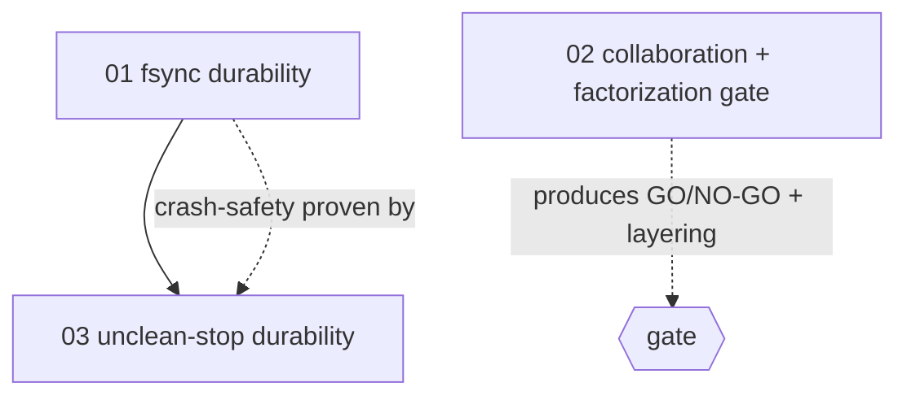

# Overview — Archil as the collaborative agentic-OS substrate: pilot

> **STATUS: PARKED** — decided + documented, **not provisioning**. We are deliberately not paying for an
> Archil account yet (operator decision). All three issues sit in **Backlog** so the fleet does not
> auto-dispatch them. OMPSQ-75 (fsync) is free / no-regret and may be promoted to Todo anytime, independent
> of the Archil decision. Un-park steps: [`docs/archil-pilot.md`](../../docs/archil-pilot.md).

Decide, with evidence, whether Archil's **collaborative substrate** (shared disks + branches/checkpoints + HITL
co-access) can underpin a cohesive collaborative HITL agentic OS for omp-squad — before writing integration
code. Source design + full red-team + reframe record: [`DESIGN.md`](DESIGN.md).

**Reframed** after the operator clarified the target is not a faster worktree backend but a collaborative
agentic OS where agentic work is *factorized* (forked/merged). The latency-vs-local gate was the wrong axis;
the gate is now **consistency/ownership under concurrent multi-client access + factorization-primitive fit**,
with latency demoted to a characterized constraint. See DESIGN.md §The reframe.

**Shape: spikes first, seam only after green.** The go/no-go needs **zero production code**. The
`OrgStorage`/`ArchilStorage` seam is the payoff, built only in a follow-up justified by a green gate.

## Scope table

| # | Concern | COMPLEXITY | Engineering-ready? | TOUCHES (primary) |
|---|---|---|---|---|
| 01 | fsync durability hardening | architectural | **yes** (no Archil dep; correct on local disk) | `src/dal/store.ts`, `src/receipts.ts` |
| 02 | Collaboration + factorization spike — THE GATE | architectural | harness **yes** / live characterization needs creds | `scripts/collab-spike-archil.ts`*, `docs/archil-pilot.md`* |
| 03 | Durability across an unclean stop | architectural | local crash-survival **yes** / real remount needs creds | `tests/persist-durability.test.ts`*, `scripts/durability-archil.ts`* |

\* new file.

## Dependencies & batches

| Concern | BLOCKED_BY | VERIFY_BLOCKER (30s check) | Parallel with |
|---|---|---|---|
| 01 fsync | — | — | 02 |
| 02 collaboration spike | — | — | 01 |
| 03 durability | 01 | `grep -n "fh.sync\|writeFileDurable" src/dal/store.ts` returns a hit | — |

- **Batch 1 (parallel, 2 agents):** `01` (fsync — `src/dal/store.ts` + `src/receipts.ts`) ‖ `02` (collaboration
  spike harness — `scripts/` + `docs/`). Disjoint files.
- **Batch 2 (1 agent):** `03` — needs 01's fsync to have a chance of passing.

## External dependency (human-supplied, gates the live characterization — not the code)

Concerns 02 and 03 build + locally validate their harness/test **now**. The *real* collaboration
characterization (02: `--shared` multi-client + branches/checkpoints) and the *real* remount survival (03)
need a human to provide an Archil account + provisioned disk(s) + `ARCHIL_*` + an AWS region. The implementing
agent MUST build + dry-run locally, then **report the missing creds as the blocker for the live run — never
fabricate a result** (AGENTS.md / delivery contract).

> **`.env.example` gotcha:** the pilot's `ARCHIL_*` vars are read in `scripts/` (throwaway), NOT `src/`.
> Document them in `docs/archil-pilot.md`; do **not** add them to `.env.example` (its
> `tests/env-example.test.ts` contract is scoped to src/-read vars).

## Pilot scope (do NOT exceed)

ONE daemon. The collaboration spike (02) **uses `--shared` + branches/checkpoints on purpose** — those are the
primitives under test. NO production integration: no `OrgStorage`/`ArchilStorage`, no registry wiring, no
eviction/unmount lifecycle. Everything beyond the 3 concerns is the deferred green-light follow-up.

## Verification posture

- 01: existing persistence round-trip tests stay green + a new test asserts durable-write atomicity and that
  `fsync` is invoked (spy) on the commit path. Gate: `bun run check` + `bun test`.
- 02: harness runs a local dry-run (N workers + branch ops simulated), emits the report skeleton, and the live
  `--shared`+branches characterization is produced with creds (else creds-blocker reported). Ends in a written
  GO/NO-GO against the reframed gate + a trunk/fork layering recommendation.
- 03: a `kill -9` of the writer (no clean unmount) followed by re-read asserts the last committed persist
  survived locally; the real-Archil remount is creds-blocked if unprovisioned.

## Plane tracking
- Project: omp-squad (`OMPSQ`) · Workspace: `inkwell-finance`
- Module: [Archil storage pilot](https://app.plane.so/inkwell-finance/projects/1eb181ba-f324-4767-a6d5-98953d5df011/modules/0ac1c99d-bf5d-428d-8b64-485469651f57/)
- Issues:
  - [02-benchmark-gate](https://app.plane.so/inkwell-finance/browse/OMPSQ-74/) — OMPSQ-74 (collaboration + factorization spike) · Backlog (PARKED) · `architectural` `external-dep`
  - [01-fsync-durability](https://app.plane.so/inkwell-finance/browse/OMPSQ-75/) — OMPSQ-75 · Backlog (PARKED; free/no-regret) · `architectural` `engineering-ready`
  - [03-durability-unclean-stop](https://app.plane.so/inkwell-finance/browse/OMPSQ-76/) — OMPSQ-76 · Backlog (blocked_by OMPSQ-75) · `architectural` `external-dep`
- Dispatch: OMPSQ is omp-squad's live auto-dispatch target. **All three parked in Backlog** (operator chose to wait on a paid Archil account). Promote OMPSQ-75 (free fsync) and/or OMPSQ-74 (the spike) to `Todo` to un-park; OMPSQ-76 is also gated on OMPSQ-75 landing.
