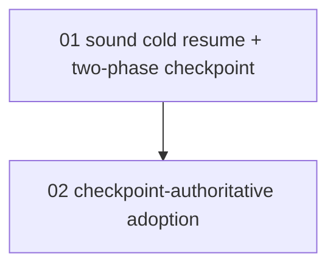

# Overview — durable, process-independent workflow resume

> **STATUS: DONE.** From `/research https://github.com/mastra-ai/mastra` (concept #1: process-independent
> durable execution). Design in `DESIGN.md`, hardened by a 2× opus red-team pass. Both concerns (C01 sound
> cold resume + two-phase checkpoint; C02 checkpoint-authoritative, loss-free adoption) implemented and
> landed green: `bun run check` clean + full `bun test` (761 pass). Tests in `tests/workflow-resume.test.ts`
> (cold re-run, two-phase, poison cap) and `tests/adopt-cap.test.ts` (parentId exclusion, deferred preserve).
>
> WIP note: this repo has other open plan dirs (e.g. `best-of-n-selection`, `mt-isolation`, `omp-planner`).
> This plan was filed at the operator's explicit direction to chain research concept #1 into `/plan`; it does
> not supersede those.

## The gap (verified in source)

The resumable `EngineCheckpoint` is persisted on every node boundary (`engine.ts:79` →
`squad-manager.ts:1461-1463`), but a crashed graph run resumes only narrowly:

- **D1** `adoptOrphanedAgents` keys resume on `persistedHasWork` (worktree dirty/ahead), not the checkpoint,
  AND the dropped record is permanently erased by the full-snapshot-replace persist (`store.ts:118-124,179-200`).
- **D2** cold resume (dead inner thread) skips the in-flight node — `resumeAgent` on a fresh thread returns
  `{succeeded,""}` (`executor.ts:149-150`) and runs the rest on a thread that never received the goal.

## Scope table

| # | Concern | COMPLEXITY | Dispatchable now? | TOUCHES (primary) |
|---|---|---|---|---|
| 01 | Sound cold resume + two-phase checkpoint | architectural | **yes** (no dep) | `src/workflow/engine.ts`, `src/workflow/executor.ts`, `src/workflow-driver.ts`, `src/workflow/types.ts`, `src/squad-manager.ts` |
| 02 | Checkpoint-authoritative, loss-free adoption | architectural | no — BLOCKED_BY 01 | `src/squad-manager.ts` |

## Dependency graph

| Concern | BLOCKED_BY | VERIFY_BLOCKER (30s check) | Parallel with |
|---|---|---|---|
| 01 sound cold resume | — | — | — |
| 02 loss-free adoption | 01 | `grep -n "cold" src/workflow/executor.ts` returns the cold-resume branch (C01 landed) — C02 must not widen cold-resume eligibility before sound cold resume exists | — |

**Ordering is load-bearing (RTS-F6):** C01 makes the cold-resume path sound; C02 widens the set of runs that
take it. Shipping C02 first opens a window where every newly-eligible cold resume hits the D2 bug. **C01
before C02, never parallel.**

**Shared-file note:** both concerns edit `src/squad-manager.ts` (C01 adds the `cold` arg on the adopt
`create()`; C02 rewrites `adoptOrphanedAgents` eligibility/preserve/flag logic). Sequential execution by the
same agent (or strict ordering) avoids the collision — do not batch them in parallel.

## Batch order
- Batch 1: C01 (single agent).
- Batch 2: C02 (single agent), after C01 lands its gate green.

Estimated 2 batches, 1 agent each. Both `architectural` (sonnet): crash-recovery, partial-failure, and
shared-state reasoning — not mechanical.

## Verification gate (both concerns)
`bun run check && bun test` — deterministic, no model tokens. New/extended tests live in
`tests/workflow-resume.test.ts` (C01) and `tests/adopt-cap.test.ts` (C02); see each concern's Verify section.

## Tracking
- Plane: not configured on this box. If wired later, file via `/plan-to-plane` into module *Workflows*,
  BLOCKED_BY edge 01→02.
- Until then this plan dir is the tracking surface; STATUS lines are the source of truth.
