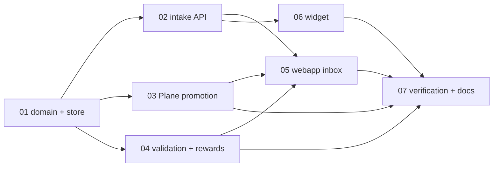

# Overview — Feedback Loop as omp-squad ingress

STATUS: closed
PRIORITY: p1
REPOS: omp-squad

Add Feedback Loop to omp-squad as a **paid-feedback ingress lane**: product users submit screenshot-based feedback; an operator reviews/validates it; accepted feedback becomes an agent-ready Plane issue; omp-squad's existing dispatcher picks it up and executes it.

This is not a standalone roadmap product and not a Marker/Userback clone. The differentiator is the handoff from paid, evidence-rich feedback into the existing autonomous implementation loop.

## Scope table

| # | Concern | Complexity | TOUCHES (primary) |
|---|---|---|---|
| 01 | Feedback domain + persistence seam | architectural | `src/types.ts`, `src/feedback.ts` (new), `src/dal/store.ts`, `src/db/schema.ts`, `src/db/migrations.ts`, `tests/feedback-store.test.ts` (new) |
| 02 | Public campaign intake API + attachment guardrails | architectural | `src/server.ts`, `src/feedback.ts`, `.env.example`, `tests/feedback-api.test.ts` (new) |
| 03 | Plane promotion renderer + status transitions | architectural | `src/feedback.ts`, `src/plane.ts`, `src/squad-manager.ts`, `src/server.ts`, `tests/feedback-promotion.test.ts` (new) |
| 04 | Validation loop + reward ledger | architectural | `src/types.ts`, `src/feedback.ts`, `src/server.ts`, `tests/feedback-validation.test.ts` (new) |
| 05 | Webapp Feedback Loop inbox | architectural | `webapp/src/App.tsx`, `webapp/src/components/layout/Sidebar.tsx`, `webapp/src/components/views/FeedbackLoopView.tsx` (new), `webapp/src/lib/dto.ts`, `webapp/src/hooks/useFeedbackLoop.ts` (new) |
| 06 | Embeddable screenshot widget | architectural | `src/web/feedback-widget.js` (new), `src/server.ts`, `tests/feedback-widget.test.ts` (new) |
| 07 | Verification + docs | mechanical | `README.md`, `docs/operations.md`, `.env.example`, affected tests above |

## Dependency graph & batch order

| Concern | BLOCKED_BY | VERIFY_BLOCKER |
|---|---|---|
| 01 | — | — |
| 02 | 01 | `grep -q "FeedbackItem" src/types.ts` and `grep -q "loadFeedback" src/dal/store.ts` |
| 03 | 01 | `grep -q "FeedbackItem" src/types.ts` and `grep -q "createPlaneIssue" src/plane.ts` |
| 04 | 01 | `grep -q "FeedbackReward" src/types.ts` |
| 05 | 02, 03, 04 | `grep -q "/api/feedback" src/server.ts` and `grep -q "promoteFeedback" src/feedback.ts` |
| 06 | 02 | `grep -q "/api/feedback/items" src/server.ts` |
| 07 | 02, 03, 04, 05, 06 | all new tests for concerns 01-06 exist |

## Batch order

- **Batch 1:** `01` only. It changes shared types, store, and migrations; do not parallelize.
- **Batch 2 (parallel):** `02`, `03`, `04`. All consume the new domain/persistence seam. They may share `src/feedback.ts`; assign non-overlapping exported functions or sequence if one agent owns the file.
- **Batch 3 (parallel):** `05`, `06`. UI/widget work consumes stable API contracts.
- **Batch 4:** `07` verification + docs.

## Shared-file analysis

- `src/feedback.ts` is shared by concerns 01-04. Concern 01 creates types/helpers; concerns 02-04 should append focused functions. If executing via agents, either assign 02-04 to one agent or run them sequentially with a prior-changes summary.
- `src/server.ts` is shared by API, promotion, validation, and widget serving. Keep route handlers tiny and delegate logic to `src/feedback.ts`.
- `.env.example` is touched by 02 and 07. Let 02 add env keys; 07 only verifies docs/tests stay aligned.
- Webapp files are isolated to 05 except route registration in `App.tsx`/`Sidebar.tsx`.

## Non-goals for this plan

- No video recording/editor.
- No crypto payout rail.
- No Tremendous/Stripe provider call.
- No public marketplace of tasks.
- No Jira/Linear adapters.
- No mobile SDK.

## Acceptance criteria

- A product can embed the widget with a campaign token and submit one screenshot feedback item.
- The operator can view feedback in the omp-squad webapp, approve/reject it, and see validation/reward state.
- Approved feedback can be promoted to a Plane issue containing evidence, validation results, reward terms, and agent-ready acceptance criteria.
- Existing Plane autodispatch can pick up the promoted issue without a new execution path.
- Reward state is tracked but no money leaves the system automatically.

## Resolution

Implemented all 7 concerns in this repo. Verification passed: feedback backend/widget/store/promotion/validation tests, webapp feedback hook test, root `bun run check`, webapp `bun run typecheck`, and touched auth/registry/rbac tests. Remaining deferred scope stays deferred by design: video, crypto, payout adapters, Jira/Linear, marketplace, mobile SDK.
