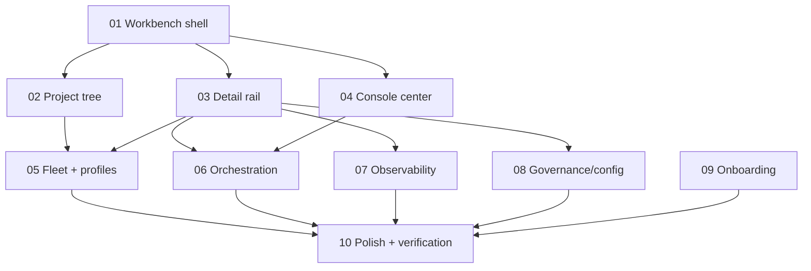

# Meta-Harness Dashboard Pages — Overview

STATUS: cancelled
PRIORITY: p0
REPOS: omp-squad
COMPLEXITY: architectural

## Goal

Turn the current route-based webapp into a dense operator workbench covering the pages shown in `plans/meta-harness/images/`:

- dedicated integrated console in the middle,
- project list on the left with collapsible agents under projects,
- collapsible right detail rail for selected agents/tasks/profiles/diffs/live preview/provenance,
- page taxonomy for heatmap, settings/configuration, fleet, profiles, best-of-N tournaments, onboarding, observer findings, fleet health, audit provenance, conflict resolver, squad overview, federation, resources, and self-extension.

## Scope table

| # | Concern | Status | Complexity | Touches |
|---|---|---|---|---|
| 01 | Workbench shell foundation | open | architectural | `webapp/src/App.tsx`, `webapp/src/components/layout/*`, new workbench components |
| 02 | Project tree + nested agents | open | architectural | `Sidebar.tsx`, `lib/projects.ts`, `hooks/useSquad.ts`, new tree components |
| 03 | Right detail rail | open | architectural | `DetailPanel.tsx`, agent/project/task/diff detail components, route state |
| 04 | Integrated console center | open | architectural | `ConsoleView.tsx`, `spawn/NewWork.tsx`, command palette, shell layout |
| 05 | Fleet + agent profile pages | open | architectural | `AgentsView.tsx`, new profiles/memory/capabilities views |
| 06 | Orchestration pages | open | architectural | `FeaturesView.tsx`, `ProjectView.tsx`, `GraphPane.tsx`, new tournament/landing/conflict views |
| 07 | Observability pages | open | architectural | `HeatmapView.tsx`, `AuditView.tsx`, new observer/trace/health/resource views |
| 08 | Governance + configuration pages | open | architectural | new settings/team/federation/triggers/resource config views |
| 09 | Onboarding + empty states | open | mechanical | onboarding route, empty states, docs |
| 10 | Page polish + verification | open | mechanical | affected webapp views, README/docs, focused tests |

## Dependency graph

## Batch order

| Batch | Concerns | Parallel? | Why |
|---|---|---|---|
| 1 | 01 | no | Shared shell contract; everything else depends on it. |
| 2 | 02, 03, 04 | partly | Can split after 01 defines shell state. 02 and 03 touch route/selection state, coordinate carefully. |
| 3 | 05, 06, 07, 08, 09 | yes by domain | Page domains mostly isolated after shell/detail contracts exist. |
| 4 | 10 | no | Cross-page consistency and verification. |

## Shared-file analysis

High-overlap files:

- `webapp/src/App.tsx`
- `webapp/src/components/layout/Sidebar.tsx`
- `webapp/src/components/layout/TopBar.tsx`
- `webapp/src/components/palette/CommandPalette.tsx`
- shared primitives in `webapp/src/components/ui/*`

Rule: Batch 1 owns shell-level shared files. Later page concerns should add views and route entries only after Batch 1 contracts are in place.

## Verification gates

- `cd webapp && bun run typecheck`
- Search affected UI for fake affordances: `href="#"`, `sample`, `demo`, `
`.
- Keyboard checks for tree nav, command input, detail rail collapse, tabs, and row actions.
- Mobile fallback: left rail hidden/collapsible, right rail overlays, middle console remains reachable.
- README updated whenever behavior/routes change.

## BLOCKED_BY / VERIFY_BLOCKER

| Concern | BLOCKED_BY | VERIFY_BLOCKER |
|---|---|---|
| 01 | none | n/a |
| 02 | 01 shell state contract | `WorkbenchShell` exposes selected project/detail setters. |
| 03 | 01 shell state contract | Selecting an agent/project can open a rail without route rewrite bugs. |
| 04 | 01 shell layout | Console can render in middle slot while right rail is open. |
| 05 | 02 + 03 | Project tree can select agents; right rail supports profile/agent details. |
| 06 | 03 + 04 | Detail rail can show diff/run/feature; console can drive actions. |
| 07 | 03 | Detail rail can show heat/audit/finding/run subjects. |
| 08 | 03 | Detail rail can show settings sections and audit history. |
| 09 | 01 | Onboarding can reuse shell or intentionally hide it for first-run. |
| 10 | all prior | All routes compile and have non-fake states. |
