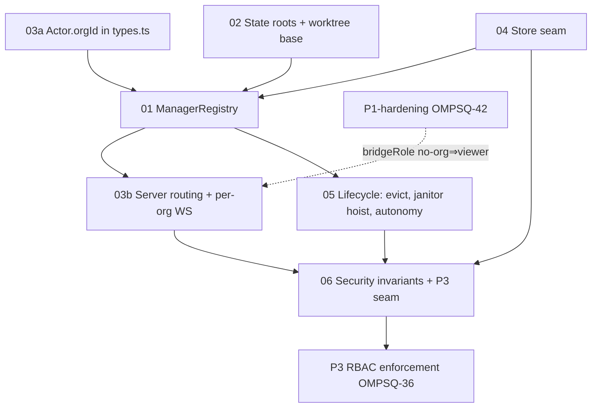

# Overview — P2: per-org runtime isolation (OMPSQ-37)

The security boundary that makes omp-squad's DB mode genuinely multi-tenant. Today **one**
`SquadManager` (src/squad-manager.ts:172) owns the entire fleet — one roster `Map`, one
`stateDir` (squad-manager.ts:206), one worktree root (worktree.ts:44), one event stream
broadcast to **all** WS clients (server.ts:525) — so every authenticated DB-mode user shares
one runtime. There is no tenant boundary. P2 gives each organization its own isolated
fleet/state, so an actor of org A can never see or touch org B's agents, transcripts,
worktrees, or events. P3 (OMPSQ-36, per-mutation RBAC) then layers authorization on top of a
runtime that is *already* org-partitioned.

This decomposition is grounded in the real code (every decision cites file:symbol). It is a
spec for a follow-up implementation squad — design only, no production code.

---

## Recommended approach (one paragraph)

**Per-org `SquadManager` instances behind a lazy registry**, not one org-aware manager. A new
`ManagerRegistry` (`src/manager-registry.ts`) holds `Map<orgId, SquadManager>`, lazily creates
+ `start()`s a manager on first authenticated request for an org, and evicts idle ones. Each
manager is constructed with an **org-scoped `stateDir`** (`<root>/orgs/<orgId>`) and an
**org-scoped worktree base** (`<root>/orgs/<orgId>/worktrees`), so the entire existing manager
runs **unchanged** per tenant — isolation is structural, not per-call discipline. The server
(`src/server.ts`) stops holding a single `manager`; it resolves the caller's org from the
better-auth session (`session.session.activeOrganizationId`, server-derived, never
client-supplied), routes REST/WS to `registry.get(orgId)`, and fans WS events out **per org**
(`clientsByOrg`) so a socket only ever sees its own org's roster. Durable per-org control-plane
data (roster index, features, **audit**, usage) is written through the existing DAL
`withOrg(ctx, orgId, …)` (src/dal/context.ts) behind a small pluggable `Store` seam; large
blobs (transcripts, receipts, digests, worktrees) stay on disk under the org's `stateDir`.
File mode (no `DATABASE_URL`) is untouched: the registry is bypassed and the single manager
runs at the root, exactly as today.

**Why a registry, not an org-aware single manager:** see 01. Short version — blast-radius
containment, zero changes to ~40 manager methods, and the manager's pervasive single-fleet
assumptions (persistence writeChain, poll/dispatch/orchestrator timers, federation bus,
supervisor budget) stay valid *per org* instead of all breaking at once.

---

## Scope table

| # | Concern | Decision area | Complexity | TOUCHES (primary) |
|---|---|---|---|---|
| 01 | Isolation model & `ManagerRegistry` | (1) isolation model | architectural | `src/manager-registry.ts`*, `src/squad-manager.ts` |
| 02 | State roots & org-scoped worktree base | (2) state roots | architectural | `src/squad-manager.ts`, `src/worktree.ts`, `src/index.ts` |
| 03 | Request routing & per-org WS broadcast | (3) routing | architectural | `src/server.ts`, `src/types.ts` |
| 04 | Data plane: pluggable `Store` over the DAL | (4) data plane | architectural | `src/dal/store.ts`*, `src/squad-manager.ts` |
| 05 | Lifecycle: lazy create/evict, locks, janitors, autonomy | (5) lifecycle | architectural | `src/manager-registry.ts`*, `src/squad-manager.ts`, `src/index.ts` |
| 06 | Security invariants & the P3 seam | (6) security | architectural | `src/server.ts`, `src/squad-manager.ts`, `src/dal/store.ts`* |

\* new file. (7) sequencing is this overview (dependency graph + batches, below).

---

## File-by-file change surface

**New files**
- `src/manager-registry.ts` — `ManagerRegistry`: `get(orgId)` (lazy create+start), per-org event
  fan-out wiring, idle eviction, and the hoisted **machine-global janitor** (host/socket reaping
  over the union of all live managers). See 01, 05.
- `src/dal/store.ts` — `Store` interface + `FileStore` (today's disk behavior) + `DbStore`
  (roster/features/audit/usage via `withOrg`). See 04.
- Tests: `tests/manager-registry.test.ts`, `tests/dal-store.test.ts`,
  `tests/ws-org-isolation.test.ts`, `tests/routing.test.ts`. See per-concern Verify + below.

**Modified**
- `src/types.ts` — add `orgId?: string` to `Actor` (types.ts:467). **P2 owns this** (confirmed
  with MtHarden: P1-hardening does not add it).
- `src/squad-manager.ts` — accept `opts.worktreeBase` and `opts.store`; route
  `persist`/`loadPersisted`/`receipts`/digests/audit through `store`; **remove** machine-global
  host/socket reaping from `start()` (hoisted to the registry — see 05); add audit writes at the
  `applyCommand` chokepoint (squad-manager.ts:943).
- `src/server.ts` — hold a `ManagerRegistry` instead of `manager` (server.ts:122); resolve org
  per request and route; add `orgId` to `SocketData` (server.ts:48); replace the single `clients`
  set + `broadcast` (server.ts:123,525) with per-org fan-out; org-scope presence/federation/push.
- `src/worktree.ts` — make the worktree base injectable: `worktreeBase()` (worktree.ts:44) and
  `addWorktree`/`resolveWorktree`/`removeWorktree` accept a `base` so the manager passes its
  org-scoped root (consumed at worktree.ts:75). See 02.
- `src/index.ts` — construct the registry + `Store` factory; keep the **single root**
  `acquireStateLock(root)` (index.ts:197) unchanged; start the external supervisor in **file mode
  only** (index.ts:221); `shutdown` stops the registry then closes db + releases lock (index.ts:229).
- `src/supervisor.ts` — documented no-op in DB mode (started only by index.ts in file mode). See 05.

---

## Dependency graph & execution batches

| Concern | BLOCKED_BY | Can parallelize with |
|---|---|---|
| 03a (Actor.orgId, a 1-field type change) | — | 02, 04 |
| 02 (state roots, worktree base) | — | 03a, 04 |
| 04 (Store seam: interface + FileStore + DbStore) | — | 02, 03a |
| 01 (ManagerRegistry) | 02, 04, 03a | — |
| 03b (server routing + per-org WS) | 01 | 05 |
| 05 (lifecycle: evict/janitor/autonomy) | 01 | 03b |
| 06 (security invariants + P3 seam) | 03b, 04, 05 | — |

**Batch order**
- **Batch 1 (parallel, 3 agents):** `03a` (Actor.orgId) ‖ `02` (state roots + worktree base) ‖
  `04` (Store seam). Disjoint files: `types.ts` / `worktree.ts`+manager-paths / `dal/store.ts`.
  The two that touch `squad-manager.ts` (02 paths, 04 store wiring) coordinate — see note.
- **Batch 2 (sequential):** `01` (ManagerRegistry) — needs the org-scoped manager constructor
  (02), the `Store` it injects (04), and `Actor.orgId` (03a).
- **Batch 3 (parallel, 2 agents):** `03b` (server routing + per-org WS) ‖ `05` (lifecycle).
  Both depend on `01`; `03b` edits `server.ts`, `05` edits `manager-registry.ts`+`index.ts` —
  mostly disjoint (both touch `index.ts` wiring → the `05` agent owns `index.ts`, `03b` hands it
  the server constructor signature over IRC).
- **Batch 4 (sequential):** `06` — verifies the invariants hold across the assembled system and
  defines the exact seam P3 plugs into.

**Same-file note:** 02 and 04 both modify `src/squad-manager.ts` (02 = worktree-base + stateDir
threading; 04 = `store` injection + persist/load rerouting). Per the repo SAME-FILE rule these
two manager edits MUST be serialized or owned by one agent. Recommended: a single
"manager-seams" agent lands 02's manager changes **and** 04's manager changes in one pass
(`opts.worktreeBase` + `opts.store` are sibling constructor options), while a second agent does
04's standalone `src/dal/store.ts`. 03a (`types.ts`) and the `worktree.ts` half of 02 stay
parallel.

---

## Risk list

1. **Cross-org host/socket reaping (data-loss class).** `reapOrphans()` calls
   `reapOrphanHosts(new Set(this.agents.keys()))` (squad-manager.ts:1296) — it kills any agent
   host *not* in the passed set. With N managers, manager A would treat org B's live hosts as
   orphans and **kill them**. `pruneStaleSockets()` (squad-manager.ts:222) is likewise
   machine-wide. MUST hoist to a registry-level janitor that reaps over the **union** of all
   managers' agent ids. See 05. *Highest risk; easy to miss; corrupts other tenants.*
2. **Worktree base is global, not under `stateDir`.** `worktreeBase()` is hardcoded to
   `~/.omp/squad/worktrees` (worktree.ts:44), independent of the manager's `stateDir`. Without
   threading an org-scoped base, two orgs' worktrees collide on
   `<base>/<repoBasename>-<branch>` (worktree.ts:75). See 02.
3. **Event leak via the single broadcast.** `broadcast()` sends to every socket (server.ts:525);
   missing the per-org fan-out leaks org A's roster/transcripts to org B. See 03.
4. **Client-supplied org spoofing.** orgId MUST be read server-side from the better-auth session,
   never from a request param/body. See 03, 06.
5. **Timer/memory growth.** Per-org poll (2.5s), dispatch (60s), presence, orchestrator timers ×
   N orgs. Mitigated by idle eviction (05); a later optimization can collapse to one shared
   ticker iterating managers.
6. **Global presence/leases registries leak repo names across orgs.** `~/.omp/squad/presence`
   and `~/.omp/squad/leases` are machine-wide, keyed by repo-hash (presence.ts:11, leases.ts:9).
   In DB mode the federation/command-center view would surface org A's repos to org B. DB mode
   must serve presence/federation from the per-org manager and skip the global file registry.
   See 06.
7. **External supervisor can't auth in DB mode.** `startSupervisor` opens one WS with the
   file-mode bearer token (supervisor.ts:248,311); DB mode has no bearer token and the WS now
   needs a session+org. Start it in file mode only; per-org auto-supervision uses the in-process
   deterministic `maybeAutoSupervise` (squad-manager.ts:1033), which is per-org for free. See 05.
8. **Federation bus + CLI assume one fleet.** `bus.onRemoteCommand` routes to one manager
   (squad-manager.ts:224); the CLI authenticates with the file-mode bearer token (index.ts via
   `tokenHeader`). Both are file-mode/self-host paths; defer cross-org federation and treat the
   CLI as file-mode-only in DB mode. See 06.

---

## Sequencing with P1-hardening (OMPSQ-42) and P3 (OMPSQ-36)

- **P1-hardening (OMPSQ-42):** lands new-user-viewer + closes self-escalation and changes
  `bridgeRole` so **no active org ⇒ viewer** (was operator). P2's routing must adopt that:
  no-org actors are viewer + routed to an empty/no-fleet response (03). P1-hardening does **not**
  add `Actor.orgId` — P2 owns it. P2's non-routing concerns (02, 04, 01 skeleton, 05 janitor
  hoist) are independent of P1-hardening and can proceed in parallel; only 03b's no-org branch
  consumes the hardened `bridgeRole`.
- **P3 (OMPSQ-36):** per-mutation RBAC enforcement plugs into the `applyCommand` chokepoint
  (squad-manager.ts:943), which is **already** the RBAC tier gate. Because P2 makes each manager
  org-scoped, P3's authorization is purely *role ↔ command* — the *org ↔ resource* check is
  structurally guaranteed (a manager physically cannot hold another org's agents). P3 therefore
  needs P2's per-org runtime + audit trail to exist first. P3 may design in parallel against this
  spec, but its enforcement implementation sequences **after** P2's chokepoints (03b routing,
  04 audit) land. See 06 for the exact seam.

---

## Verification posture

- Pure/unit: `ManagerRegistry` get/evict/janitor-union (`tests/manager-registry.test.ts`);
  `DbStore` round-trips under two distinct orgs assert zero cross-read (`tests/dal-store.test.ts`,
  reuse the in-memory SQLite + `withOrg` pattern; RLS is Postgres-only so SQLite proves the
  explicit-predicate guard).
- Integration: two better-auth sessions in two orgs against one `SquadServer`; org A's WS never
  receives org B's roster/agent/transcript events (`tests/ws-org-isolation.test.ts`); REST
  `GET /api/agents` returns only the caller's org; a spoofed org param is ignored
  (`tests/routing.test.ts`). Reuse the live-server harness from `tests/rbac.test.ts`.
- Gate: `bun run check` (types) + the full `bun test` suite green.

## Plane tracking
- Project: omp-squad (`OMPSQ`) · Umbrella: **OMPSQ-37** (P2 per-org runtime isolation) — ✅ done
- Module: Multi-tenant SaaS (with P0/P1/P1-hardening/P3). Concern → issue:
  - 01 ManagerRegistry → OMPSQ-43 ✅ · 02 state roots → OMPSQ-44 ✅ · 04 Store seam → OMPSQ-45 ✅
  - 03 routing + per-org WS → OMPSQ-46 ✅ · 05 lifecycle → OMPSQ-48 ✅ · 06 security → OMPSQ-47 ✅
- P3 RBAC enforcement → OMPSQ-36 ✅ (src/authz.ts role↔action map). P1 hardening → OMPSQ-42 ✅.
- Landed across: 01/02/04/05 by the autonomous fleet (ompsq-37 lands) + tests/land-audit (2a131fe);
  03b/06 integration (b8a48c8); P3 authz (cf8a726). Gate: `bun run check` + `bun test` → 417 pass / 0 fail.
