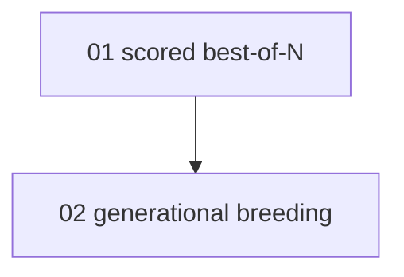

# Overview — Best-of-N scored selection for workflow fan-out

> **STATUS: IN PROGRESS — PRIORITY: p2 (low).** Dispatched to the fleet as agent
> `best-of-n-mqr87z68-y6cg` (worktree `omp-squad-squad-best-of-n-...`), gate `bun run check && bun test`.
> Was parked (operator marked low priority); operator then said "squad it". Lands on a green gate.

Source research: `/research https://en.wikipedia.org/wiki/Evolved_antenna`. The transferable nucleus of
an evolved antenna — *population-based parallel search + a numeric multi-objective fitness + selection by
score* — maps directly onto omp-squad's existing fan-out, which today **does not select by quality**.

**The gap (verified):** `runParallel` in `src/workflow/engine.ts:104-131` joins parallel branches with a
**binary** policy — `first_success` (any passer) or `wait_all` (all pass). Neither *picks the best*; the
acceptance gate (`src/validate.ts`, `--verify`) is pass/fail with no score. Fan-out gives redundancy, not a
tournament.

## Scope table

| # | Concern | COMPLEXITY | Dispatchable now? | TOUCHES (primary) |
|---|---|---|---|---|
| 01 | Scored best-of-N selection (`join_policy: best` + scored gate) | moderate | **yes** (no dep) | `src/workflow/engine.ts`, `src/validate.ts`, `src/land.ts` |
| 02 | Generational breeding from survivors (mutate/crossover, not just repair) | architectural | deferred (write when 01 lands) | failure-router/orchestrator + `src/workflow/engine.ts` |

\* 02 is a deliberate YAGNI deferral — not authored until 01 is landing. It needs 01's selection to exist
first, and the operator may never want it. Don't pre-write a blocked, low-priority concern.

## Dependencies

| Concern | BLOCKED_BY | Parallel with |
|---|---|---|
| 01 scored best-of-N | — | — |
| 02 generational breeding | 01 | — |

## Cost discipline (the ponytail check on the whole idea)

N candidates = N× model spend. Evolved antennas were reserved for *mission-critical, conflicting*
requirements — not routine work. Best-of-N is opt-in per fan-out, gated by the existing
`OMP_SQUAD_MAX_WIP` / `MAX_AGENTS` caps. Single-shot `--verify` stays the default for ordinary tickets.

## Tracking
- Plane: **not configured on this box** (no auto-dispatch). If Plane is later wired, file via `/plan-to-plane`
  into module *Workflows* at `priority: low`, BLOCKED_BY edge 01→02.
- Until then this plan dir is the tracking surface; STATUS lines are the source of truth.
